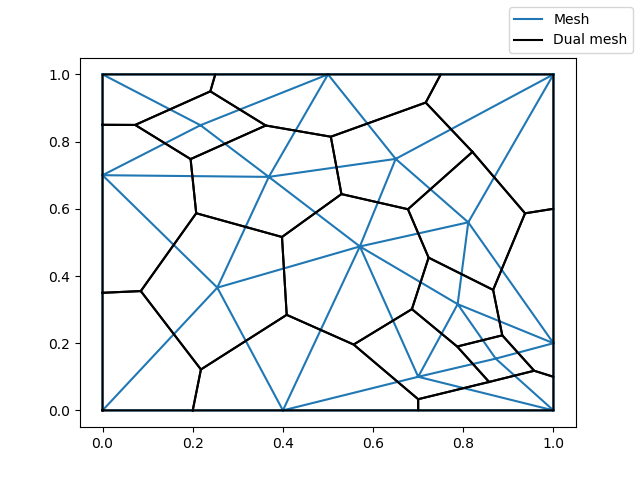

# DualMesh [](https://travis-ci.org/BartoszBartmanski/DualMesh)

Python module for generating dual meshes.

## Requirements

* meshio >= 3.2.6
* numpy >= 1.16.3

## Installation

Copy dual_mesh.py from the repository to where you wish to use it.

## Example

We can go through the example of using dual_mesh.py module.

First, we import all the needed modules
```
# For opening a mesh file
import meshio
# For generating a dual mesh
import dual_mesh as dm
# For plotting both the mesh and dual mesh
import matplotlib.pyplot as plt
```

We load the mesh for which we want a dual mesh
```
msh = meshio.read("example.msh")
```

We get the dual mesh object using dual_mesh.py
```
dual_msh = dm.get_dual(msh, order=True)
```

We use matplotlib to plot the original mesh
```
fig, ax = plt.subplots()
ax.triplot(msh.points[:, 0], msh.points[:, 1], msh.cells["triangle"])
```

We loop over the polygons (cells) in the dual mesh and we plot them
```
for cell in dual_msh.cells["polygon"]:
    # We get the coordinates of the current polygon.
    # We repeat one of the points, so that when plotted, we get a complete polygon
    cell_points = dual_msh.points[cell + [cell[0]]]

    # We plot the points of the current polygon
    ax.plot(cell_points[:, 0], cell_points[:, 1], ":", color="black")
```

And finally we add the legend and save the resulting figure
```
# We add a legend to the figure
fig.legend([ax.lines[0], ax.lines[-1]], ["Mesh", "Dual mesh"])
# We save the resulting figure
fig.savefig("example.png")
```


